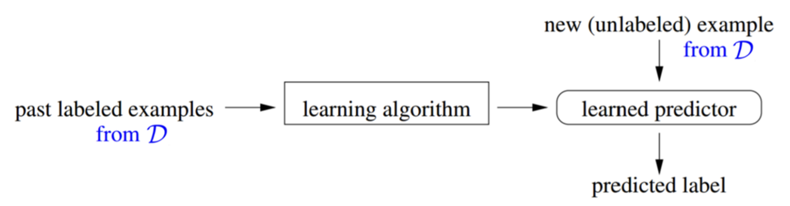
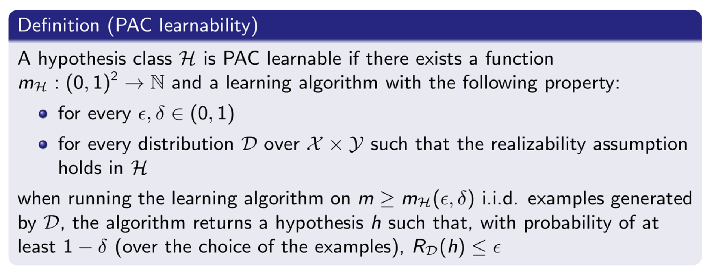
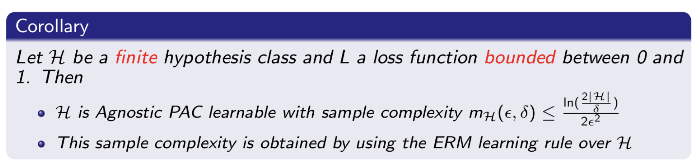
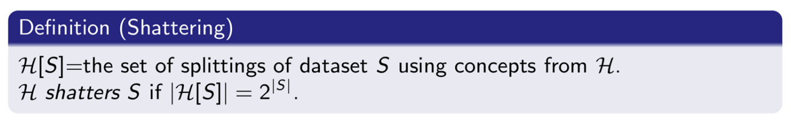
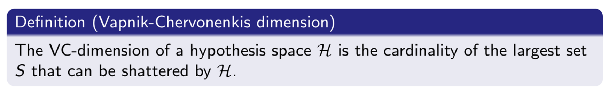
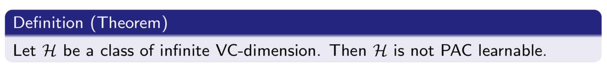
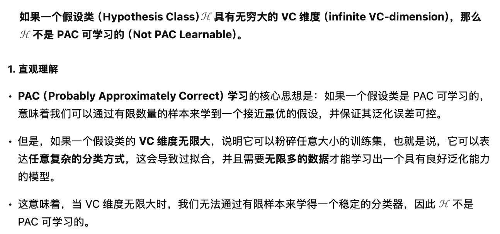
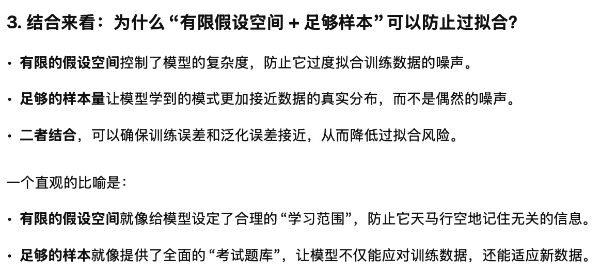
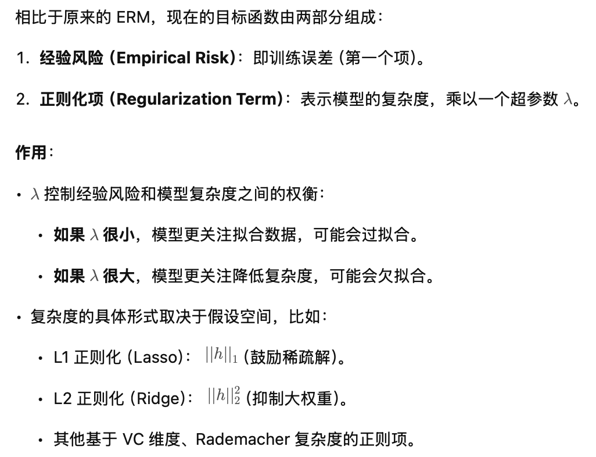

Let $\mathcal{X}$ is the *input space*, and $\mathcal{Y}$ is the *output space*.
Labeled example: $(\mathrm{x}, y)\in\mathcal{X}\times\mathcal{Y}$ . Interpretation:
- $\mathrm{x}$ represents the description or measurements of an object;
- $y$ is the category to which that object belongs.
#### Loss
Assume there is a distribution $\mathcal{D}$ over space of labeled examples $\mathcal{X}\times\mathcal{Y}$.
- $\mathcal{D}$ is ***unknown***, but it represents the population we care about;
- ***Correct*** labeling function: $f: \mathcal{X}\rightarrow\mathcal{Y}$ and that $Y=f(X)$;
- We define the ***Loss*** of the classifier $h$
$$
L(h(X), f(X)) = L(h(X), Y)=\left\{
\begin{array}{lr}
1,& \mathtt{if}\ h(X)\neq Y\\
0,& \mathtt{if}\ h(X) = Y
\end{array}
\qquad 0-1\ Loss
\right.
$$
#### True Risk
The ***true risk*** of a classifier $h$ is `the probability that not predict correctly` on $\mathcal{D}$
$$
R_{\mathcal{D}}(h):= \mathbb{P}[h(X)\neq f(X)] = \mathbb{P}[h(X)\neq Y]
$$
In other words, the ***true risk*** is the expected value of the loss
$$
R_{\mathcal{D}}(h):=\mathbb{E}_{X\sim\mathcal{D}}\{L(h(X), Y)\}
$$
>Bayes Classifier
>To find $h:\mathcal{X}\rightarrow\mathcal{Y}$, we try to minimize the ***True Risk*** $\mathbb{P}[h(x)\neq y]$, such that
>$$h(x)=\mathop{\arg\max}\limits_{y\in\mathcal{Y}}\ \mathbb{P}[Y=y|X=x]$$
>As we already know, this is ***Bayes Classifier***.
#### Bayes Risk
Donate by $h^*$ the Bayes classifier
- For the ***Bayes Risk*** $R_{\mathcal{D}}(h^*)$ it holds $R_{\mathcal{D}}(h^*)\leq R_{\mathcal{D}}(h)$ for any $\mathcal{H}$ and $h\in\mathcal{H}$, where $\mathcal{H}$ refer to the set of all possible classifiers.
- You cannot improve over the Bayes Risk.

### Batch Learning

We do not know $f$ and we need to estimate $h$ from the data
- Learner's input: Training data $S = \{(x_1, y_1)\dots(x_m, y_m)\}\in (\mathcal{X}\times\mathcal{Y})^m$
- Learner's output: A prediction rule $h:\mathcal{X}\rightarrow\mathcal{Y}$
The goal of learner is that `h shoud be correct on future examples`.

#### IID condition
Key assumption: *an i.i.d.(identically and independently distribution) sample from $\mathcal{D}$*.

This assumption is the `connection between what we've seen in the past and what we expect to see in the future`.

#### Empirical Risk
Calculate Empirical Risk by benchmarking the prediction against ground truth:
$$
R_S(h) = \frac{1}{m}\sum^m_{i=1}\mathbb{I}[h(x_i)\neq y_i]
$$
where $\mathbb{I}$ is the indicator function means the Loss function here is 0-1 Loss.

### Probably Approximately Correct (PAC) Learning

>Can Only Be Probably Correct
>***Claim***: Even when $R_{\mathcal{D}}(h^*)=0$, we can't hope to find $h$ s.t. $R_{\mathcal{D}}(h)=0$.
>***Relaxation***: $R_{\mathcal{D}}(h)\leq \epsilon$, where $\epsilon$ is user-specified

>Can Only Be Approximately Correct
>***Claim***: No algorithm can guarantee $R_{\mathcal{D}}\leq \epsilon$ for sure.
>***Relaxation***: Allow the alg. to fail with probability $\delta$, where $\delta\in(0,1)$ is user-specified.

1. The learner doesn't know $\mathcal{D}$ and Bayes predictor $h^*$.
2. The learner specifies the ***accuracy parameter*** $\epsilon$ and ***confidence parameter*** $\delta$.
3. The number of examples can depend on the value of $\epsilon$ and $\delta$, which we call it $m(\epsilon, \delta$); but not depend on distribution $\mathcal{D}$ or Bayes function.
4. Learner should output a hypothesis $h$ s.t. $\mathbb{P}[R_{\mathcal{D}}\leq\epsilon]\geq1-\delta$.

That is ***PAC Learning***.

>Realizability Assumption
>Assume that, for a given class $\mathcal{H}$ of functions $f:\mathcal{X}\rightarrow\mathcal{Y}$, there exists $h^*\in\mathcal{H}$ such that $R_{\mathcal{D}}(h^*)=0$, which implies that $h^*$ is the Bayes classifier.

$m_{\mathcal{H}}$ is called the ***sample complexity*** of learning $\mathcal{H}$.

**PAC Learnability*** 的核心思想是：如果一个假设类是 PAC Learnable，意味着我们可以通过有限数量的样本来学到一个接近最优的假设，并保证其泛化误差可控。

With more constraints, 

for example, the "0-1 Loss" is okay for that, but square Loss isn't because it not bounded.

### Shattering & VC-dimension

Which are the important concepts to measure complexity of hypothesis space.

对于一个假设集合（Hypothesis Class）$\mathcal{H}$，如果它能够在一个大小为 $m$ 的数据集上**实现所有可能的二分类标记方式**，那么我们说 $\mathcal{H}$ **shatter[v.粉碎]** 了该数据集。i.e. 假设有一个二分类模型（例如直线分类器）和一个数据集，如果能找到某种参数设定，使得该模型能够对数据点的所有可能标签分配方式都正确分类，则称该模型 shatter 了这个数据集。

假设空间 $\mathcal{H}$ 的 **VC 维度**（ VC($\mathcal{H}$) ）是 $\mathcal{H}$ **可以粉碎的最大数据点数**。

> In order to prove that $VC(\mathcal{H})$ is at least $d$, we need to show only that there's at least ***one*** set of size $d$ that can be shattered by $\mathcal{H}$.

> Linear Classifier
> Consider $\mathcal{H}$ as the set of linear classifiers in $d$ dimensions, then $VC(\mathcal{H}) = d+1$.

#### Not PAC Learnable

#### Infinite Hypothesis Classes
-  理论上，假设类可以是无限的，但计算机实现时会受限于离散化存储，任何模型参数都是以浮点数存储的，对于$32\ \mathrm{bits}$ 的浮点数就只有 $2^{32}$ 种可能的取值，因此假设类在计算上是有限的。
- 对于具有 $d$ 个参数的模型，假设类的大小可以估计为 $2^{32d}$，并且经验法则告诉我们，至少需要 $10d$ 个样本来有效训练模型。

### Overfitting
The model has pretty excellent performance on the training set, but poor performance on the test data or the real world.

### Regularization ERM (Empirical Risk Minimization)
$$
h_S = \mathop{\arg\min}\limits_{h\in\mathcal{H}}\left(\frac{1}{m}\sum_{i=1}^m\mathbb{I}[h(x_i)\neq y_i]+\lambda\ \mathrm{Complexity}(h) \right)
$$

