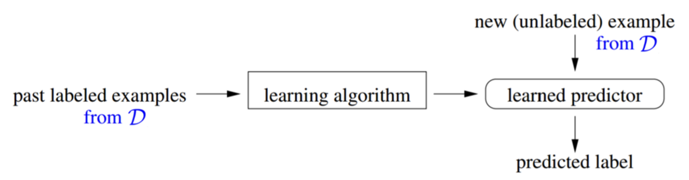
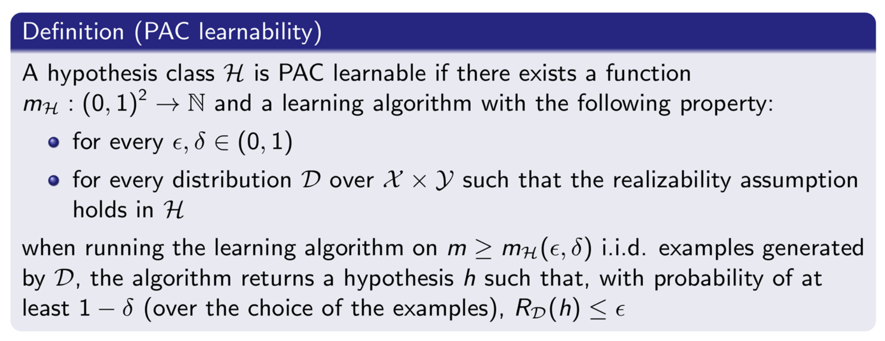
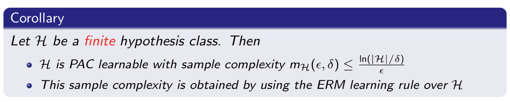
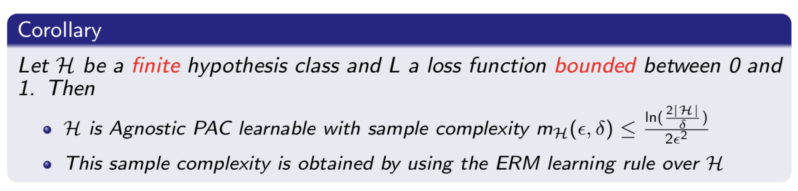
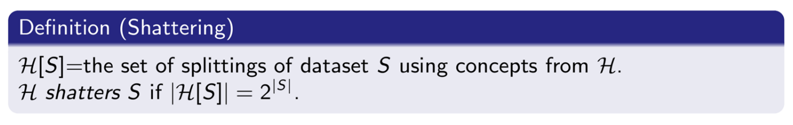
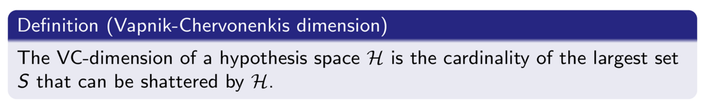
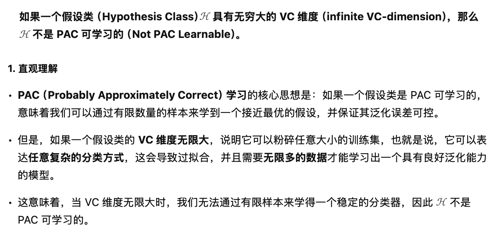
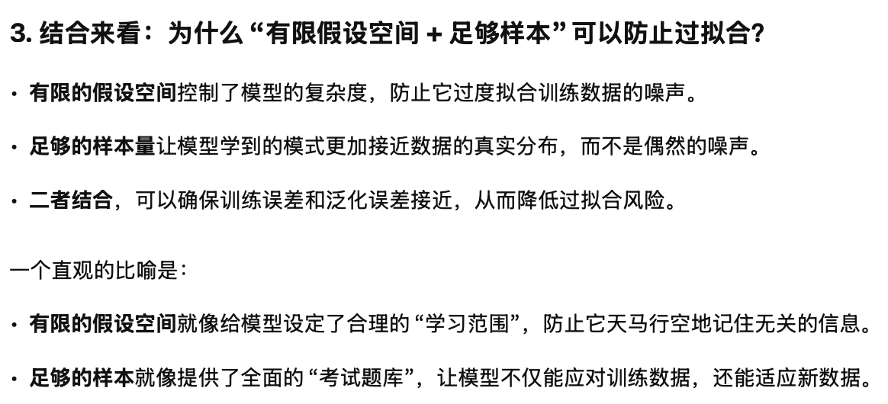
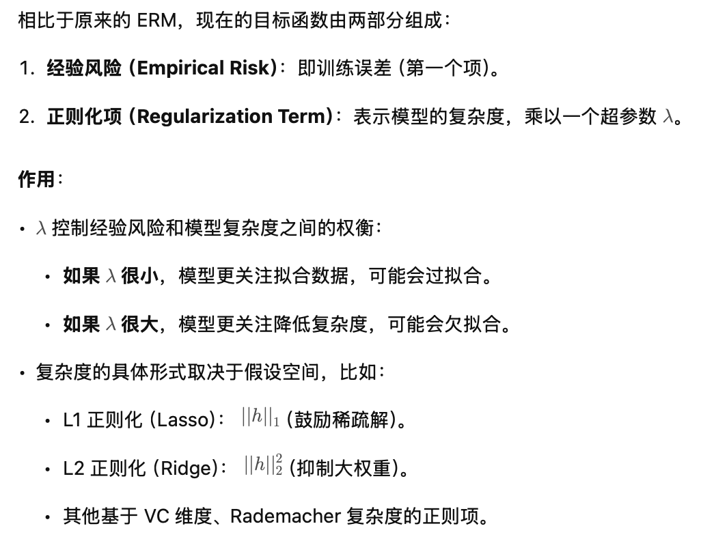

Learning theory asks a deceptively simple question: **when can good performance on a finite training set be trusted to generalize to unseen data?** To answer it, we need precise definitions of error, a model of how data is sampled, and a way to describe the complexity of the hypotheses a learner may choose from.

This note develops those ideas in the following order:

1. loss and population risk;
2. the Bayes classifier and Bayes risk;
3. empirical risk minimization from i.i.d. data;
4. PAC learning and sample complexity;
5. shattering, VC dimension, overfitting, and regularization.

<!-- more -->

## 1. The statistical learning setup

Let $\mathcal{X}$ be the **input space** and $\mathcal{Y}$ the **output space**. A labeled example is a pair

$$
(X,Y) \in \mathcal{X} \times \mathcal{Y},
$$

where $X$ describes an object and $Y$ is its target label. We assume that examples are drawn from an unknown joint distribution $\mathcal{D}$ over $\mathcal{X}\times\mathcal{Y}$.

A classifier is a function

$$
h: \mathcal{X} \rightarrow \mathcal{Y}.
$$

The learner does not know $\mathcal{D}$. It must infer a useful classifier from a finite sample drawn from that distribution.

### 1.1 Loss

A loss function quantifies the cost of a prediction. For classification, the **0–1 loss** records whether a prediction is wrong:

$$
\ell(h(X),Y)
=
\begin{cases}
1, & h(X) \neq Y,\\
0, & h(X) = Y.
\end{cases}
$$

This loss treats every mistake equally. Other tasks may use different losses—for example, squared loss for regression or cross-entropy during classifier training.

### 1.2 Population risk

The **population risk**, also called the **true risk** or **generalization error**, is the expected loss on a fresh example from $\mathcal{D}$:

$$
R_{\mathcal{D}}(h)
:=
\mathbb{E}_{(X,Y)\sim\mathcal{D}}
\left[\ell(h(X),Y)\right].
$$

Under 0–1 loss, this expectation is exactly the probability of misclassification:

$$
R_{\mathcal{D}}(h)
=
\mathbb{P}_{(X,Y)\sim\mathcal{D}}\!\left[h(X)\neq Y\right].
$$

Population risk is the quantity we ultimately care about, but it cannot usually be computed because $\mathcal{D}$ is unknown.

## 2. Bayes classifier and Bayes risk

For each input $x$, the **Bayes classifier** chooses a label with the highest conditional probability:

$$
h_{\mathrm{Bayes}}(x)
\in
\operatorname*{arg\,max}_{y\in\mathcal{Y}}
\mathbb{P}(Y=y\mid X=x).
$$

Under 0–1 loss, this rule minimizes population risk among all measurable classifiers. Its risk,

$$
R^* := R_{\mathcal{D}}(h_{\mathrm{Bayes}}),
$$

is called the **Bayes risk**, and

$$
R^* \leq R_{\mathcal{D}}(h)
$$

for every classifier $h$.

The Bayes risk need not be zero. If the same input can genuinely have different labels, some error is irreducible. A deterministic labeling rule $Y=f(X)$ is therefore a special, noise-free case rather than a default assumption.

## 3. Batch learning from data

In batch learning, the learner receives a fixed training set

$$
S=\left\{(x_1,y_1),\ldots,(x_m,y_m)\right\}
\in (\mathcal{X}\times\mathcal{Y})^m
$$

and outputs a prediction rule $h_S:\mathcal{X}\rightarrow\mathcal{Y}$. The goal is not merely to fit $S$, but to perform well on new examples from the same population.

### 3.1 The i.i.d. assumption

The standard assumption is that

$$
(X_1,Y_1),\ldots,(X_m,Y_m)
\overset{\mathrm{i.i.d.}}{\sim}\mathcal{D}.
$$

This means that the examples are **independent** of one another and **identically distributed** according to $\mathcal{D}$.

The i.i.d. assumption is the bridge between past observations and future data. If the deployment distribution differs substantially from the training distribution, standard generalization guarantees may no longer apply.

### 3.2 Empirical risk

Because population risk is unavailable, we estimate it using the average loss on the training set. The **empirical risk** is

$$
R_S(h)
:=
\frac{1}{m}\sum_{i=1}^{m}\ell(h(x_i),y_i).
$$

For 0–1 loss,

$$
R_S(h)
=
\frac{1}{m}\sum_{i=1}^{m}
\mathbb{I}\!\left[h(x_i)\neq y_i\right],
$$

where $\mathbb{I}[\cdot]$ is the indicator function.

### 3.3 Empirical risk minimization

Given a hypothesis class $\mathcal{H}$, **empirical risk minimization** (ERM) selects

$$
h_S
\in
\operatorname*{arg\,min}_{h\in\mathcal{H}} R_S(h).
$$

Low empirical risk alone is not enough: a class that is too expressive may memorize the sample. Learning theory studies the conditions under which empirical risk is a reliable proxy for population risk.

## 4. Probably Approximately Correct learning

PAC learning separates a guarantee into two tolerances:

- **Approximately correct:** the learned hypothesis may have population risk up to an accuracy tolerance $\epsilon>0$.
- **Probably correct:** the guarantee may fail with probability at most $\delta\in(0,1)$ over the random draw of the training sample.

Equivalently, the desired event should occur with probability at least $1-\delta$.

### 4.1 Realizable PAC learning

The **realizability assumption** says that some hypothesis in $\mathcal{H}$ labels the population perfectly. In other words, there exists $h^*\in\mathcal{H}$ such that

$$
R_{\mathcal{D}}(h^*)=0.
$$

Under this assumption, $\mathcal{H}$ is PAC learnable if there is an algorithm $A$ and a sample-complexity function $m_{\mathcal{H}}(\epsilon,\delta)$ such that, for every distribution satisfying realizability and every $m\geq m_{\mathcal{H}}(\epsilon,\delta)$,

$$
\mathbb{P}_{S\sim\mathcal{D}^m}
\left[
R_{\mathcal{D}}(A(S))\leq\epsilon
\right]
\geq 1-\delta.
$$

The sample complexity may depend on $\epsilon$, $\delta$, and the class $\mathcal{H}$, but not on the unknown distribution itself. PAC learnability therefore means that a finite amount of data is sufficient to obtain a controlled generalization error with high confidence.

### 4.2 Agnostic PAC learning

Real-world data may contain noise, and $\mathcal{H}$ may not include a perfect classifier. **Agnostic PAC learning** removes the realizability assumption and instead asks the learner to approach the best risk available within $\mathcal{H}$:

$$
\mathbb{P}_{S\sim\mathcal{D}^m}
\left[
R_{\mathcal{D}}(A(S))
\leq
\inf_{h\in\mathcal{H}}R_{\mathcal{D}}(h)+\epsilon
\right]
\geq 1-\delta.
$$

For a finite hypothesis class, standard uniform-convergence bounds have the qualitative form

$$
m
=
O\!\left(
\frac{\log|\mathcal{H}|+\log(1/\delta)}{\epsilon^2}
\right)
$$

in the agnostic setting. The important message is not the hidden constant, but the dependence: stronger accuracy and confidence requirements demand more data, while a larger hypothesis class carries a complexity cost.

### 4.3 Why boundedness matters

Many elementary concentration arguments assume a bounded loss. The 0–1 loss is bounded in $[0,1]$, so it fits this framework directly. Squared loss is unbounded unless the predictions and targets are themselves restricted; it therefore requires additional assumptions or different tools.

## 5. Hypothesis-class complexity

Counting hypotheses works for finite classes, but many useful model families are infinite. Treating floating-point implementations as technically finite does not resolve the theoretical question: the guarantee should describe the mathematical class and explain which structural property controls generalization.

For binary classification, that property is often the **VC dimension**.

### 5.1 Shattering

Let $C=\{x_1,\ldots,x_m\}\subseteq\mathcal{X}$. A binary hypothesis class $\mathcal{H}$ **shatters** $C$ if it can realize every possible binary labeling of those points:

$$
\left|
\left\{
(h(x_1),\ldots,h(x_m)):h\in\mathcal{H}
\right\}
\right|
=2^m.
$$

The hypothesis used may change from one labeling to another. Shattering does not require a single classifier to realize all labelings simultaneously.

### 5.2 VC dimension

The **VC dimension** of $\mathcal{H}$, written $\operatorname{VCdim}(\mathcal{H})$, is the largest size of a set shattered by $\mathcal{H}$. If arbitrarily large finite sets can be shattered, the VC dimension is infinite.

To prove that $\operatorname{VCdim}(\mathcal{H})\geq d$, it is enough to exhibit **one** set of $d$ points that $\mathcal{H}$ can shatter. To prove that $\operatorname{VCdim}(\mathcal{H})<d$, one must show that **no** set of $d$ points can be shattered.

For affine linear classifiers in $\mathbb{R}^d$—hyperplanes with a bias term—

$$
\operatorname{VCdim}(\mathcal{H})=d+1.
$$

Under the standard measurability assumptions, a binary hypothesis class is distribution-free PAC learnable if and only if it has finite VC dimension. Infinite classes can therefore be perfectly learnable; what matters is their capacity, not whether they contain infinitely many functions.

## 6. Overfitting and regularization

**Overfitting** occurs when a model achieves very low training error but performs poorly on unseen data. It often arises when the selected hypothesis is too sensitive to the finite sample—especially when the class is highly expressive relative to the amount of data.

Regularization modifies ERM by penalizing complexity:

$$
h_S
\in
\operatorname*{arg\,min}_{h\in\mathcal{H}}
\left[
R_S(h)+\lambda\,\Omega(h)
\right],
$$

where $\Omega(h)$ measures some notion of complexity and $\lambda\geq0$ controls the trade-off between fitting the sample and preferring a simpler hypothesis.

Regularization does not merely mean “make the model small.” The penalty encodes an inductive bias: a preference for hypotheses expected to generalize better. Examples include weight decay, sparsity penalties, margin maximization, early stopping, and data augmentation.

## 7. The central picture

The main objects of learning theory fit together as follows:

$$
\text{sample }S
\xrightarrow{\text{learning algorithm}}
h_S
\xrightarrow{\text{generalization analysis}}
R_{\mathcal{D}}(h_S).
$$

Empirical risk tells us how well $h_S$ fits observed data. PAC guarantees quantify the accuracy and confidence we can expect on unseen data. VC dimension measures whether the hypothesis class has enough capacity to overfit arbitrary labels. Regularization and class design then provide practical ways to manage that capacity.

The recurring lesson is that generalization depends on a balance among **data quantity**, **hypothesis-class complexity**, **optimization**, and **assumptions about how the data is generated**.
